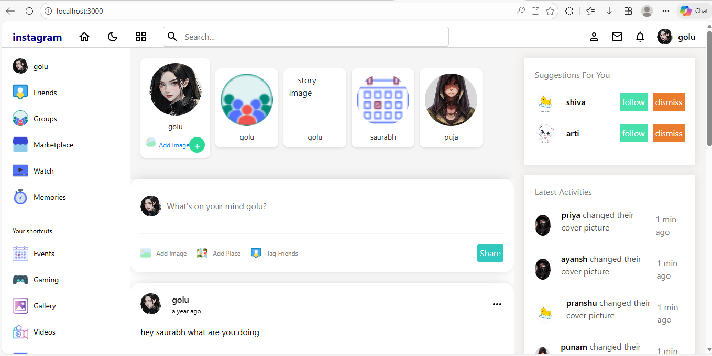
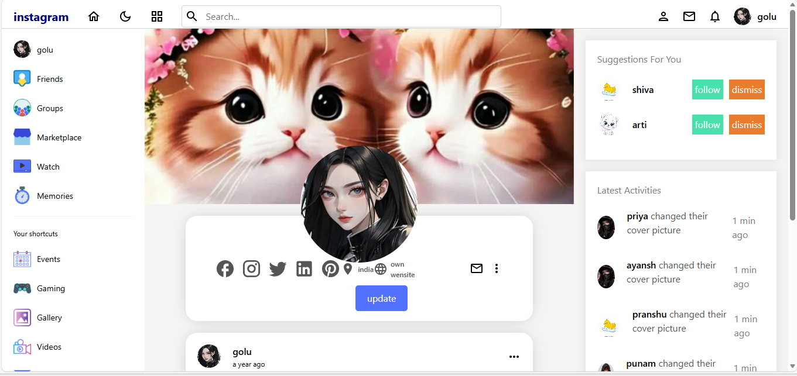

# 📸 Instagram Clone

This project implements features such as:
- User authentication (login/register)
- Upload posts, comments, likes
- Follow/unfollow users
- Update profile
- Upload stories
- Secure login system with validation

---

## 🚀 Tech Stack
- **Frontend:** React, SCSS
- **Backend:** Node.js, Express, MySQL
- **Database:** MySQL

---

## 📷 Screenshots

### Homepage


### prfile Page


### Login Page


### Profile Page


---

## ⚙️ Installation
1. Clone the repository:
   ```bash
   git clone https://github.com/Nidhi123-lab/INSTAGRAM-CLONE.git


2. Navigate to the project folder:

cd INSTAGRAM-CLONE

3. Install dependencies:

npm install

4. Start the project:

npm start